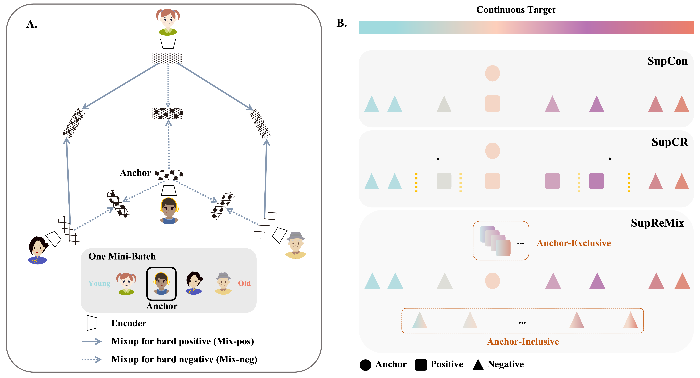

# Mixup Your Own Pairs

This repository contains the implementation code for paper: <br>
__Mixup Your Own Pairs__ <br>
Yilei Wu*, Zijian Dong*, Chongyao Chen, Wangchunshu Zhou, Juan Helen Zhou (* equal contribution)


## Mixup your own pairs for supervised contrastive regression
In representation learning, regression has traditionally received less attention than classification. Directly applying representation learning techniques designed for classification to regression often results in fragmented representations in the latent space, yielding sub-optimal performance. In this paper, we argue that the potential of contrastive learning for regression has been overshadowed due to the neglect of two crucial aspects: ordinality-awareness and hardness. To address these challenges, we advocate "mixup your own contrastive pairs for supervised contrastive regression", instead of relying solely on real/augmented samples. Specifically, we propose **Sup**ervised Contrastive Learning for **Re**gression with **Mix**up (__SupReMix__). It takes anchor-inclusive mixtures (mixup of the anchor and a distinct negative sample) as hard negative pairs and anchor-exclusive mixtures (mixup of two distinct negative samples) as hard positive pairs at the embedding level. This strategy formulates harder contrastive pairs by integrating richer ordinal information. Through extensive experiments on six regression datasets including 2D images, volumetric images, text, tabular data, and time-series signals, coupled with theoretical analysis, we demonstrate that SupReMix pre-training fosters continuous ordered representations of regression data, resulting in significant improvement in regression performance. Furthermore, SupReMix is superior to other approaches in a range of regression challenges including transfer learning, imbalanced training data, and scenarios with fewer training samples.
## Overview
<div align="center">
  
</div>

## Usage
We separate the codebase for different datasets into different subfolders. Please go into the subfolders for more information (e.g., installation, dataset preparation, training, evaluation & models).

#### IMDB-WIKI &nbsp;|&nbsp; AgeDB-DIR &nbsp;|&nbsp; STS-B-DIR &nbsp;|&nbsp; UCI-airfoil &nbsp;|&nbsp; UK Biobank  &nbsp;|&nbsp; HCP-Aging

## Code Preview

Coming Soon!

## Updates
- [09/2023] [arXiv version](https://arxiv.org/abs/2309.16633) posted. Please stay tuned for updates.

## Citation
If you find this code or idea useful, please cite our work:
```bib
@misc{wu2023mixup,
      title={Mixup Your Own Pairs}, 
      author={Yilei Wu and Zijian Dong and Chongyao Chen and Wangchunshu Zhou and Juan Helen Zhou},
      year={2023},
      eprint={2309.16633},
      archivePrefix={arXiv},
      primaryClass={cs.LG}
}
```

## Contact
If you have any questions, feel free to contact us through email (yilei.wu@u.nus.edu & zijian.dong@u.nus.edu) or Github issues. Enjoy!


## Acknowledgment

The code is based on [Yang et al., Delving into Deep Imbalanced Regression, ICML 2021](https://github.com/YyzHarry/imbalanced-regression). 